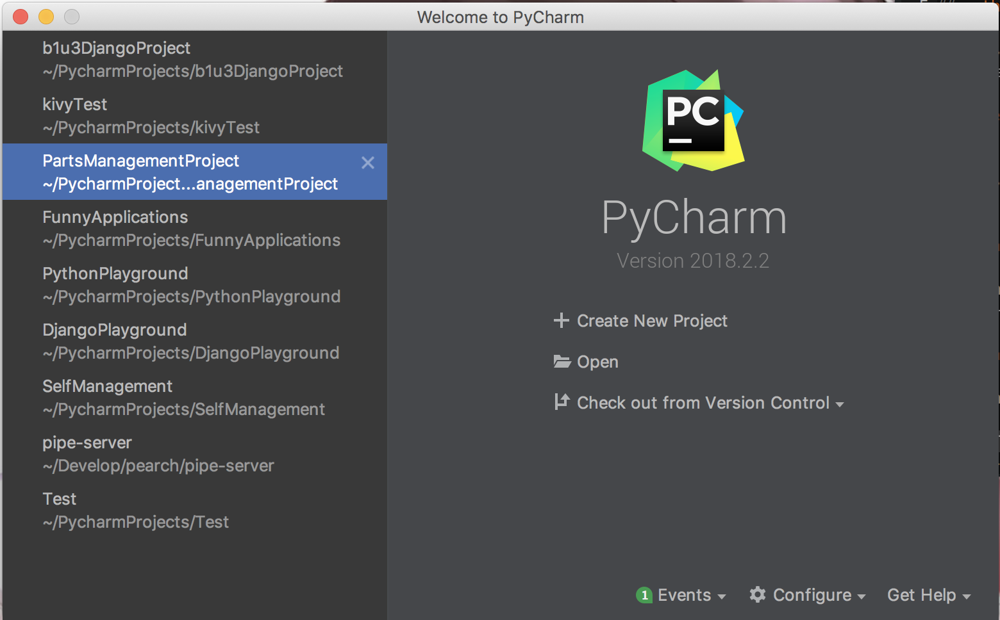
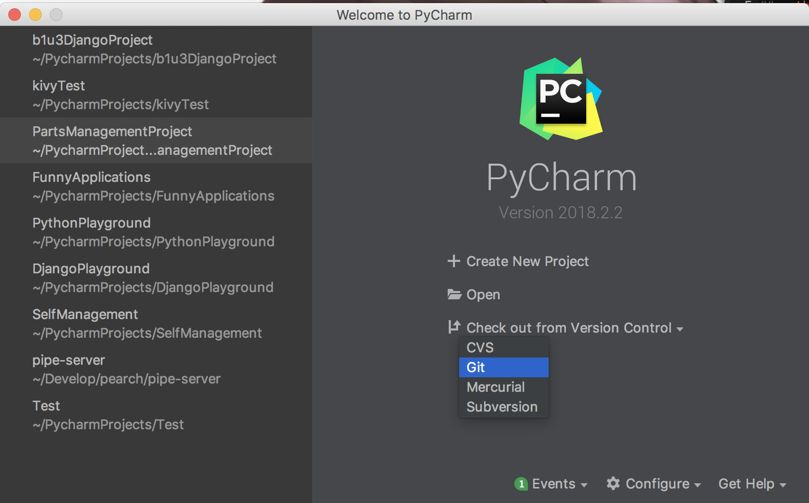
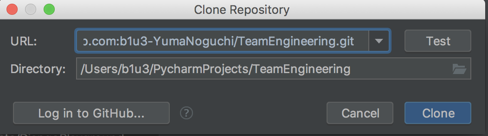

# 環境構築


## pythonのインストール

windows,os x共に公式サイトからインストーラーをダウンロードしてインストール
バージョンは3.7.1

## pipenvのインストール

```
pip install pipenv
``` 

## pycharmのインストール

pycharmの公式サイトからProfessional Edition(有料)をアカデミック用に無料でダウンロードして、インストールする。

## pycharmをインストールしたら

pycharmを開いて、メインのcheck out from Version Controlをクリック。gitを選んで、このリポジトリのURLを入力する。







開いたら左上のpreferenceからプロジェクト設定を開いて、django projectに設定する。

## pycharmが使えなかったら
cloneする。

```
%git clone https://repo.git（自分で入力して...）
```

pipenvで必要なライブラリをインストールする

```
%pipenv install
```
pythonをシステム用のからこのプロジェクト専用のpythonに切り替える

```
%pipenv shell
```

確認

```
%python --version
```

```
%pip freeze
```

必要なものだけが入っていればおっけー。

```
%exit
```

システムのpythonに戻る

