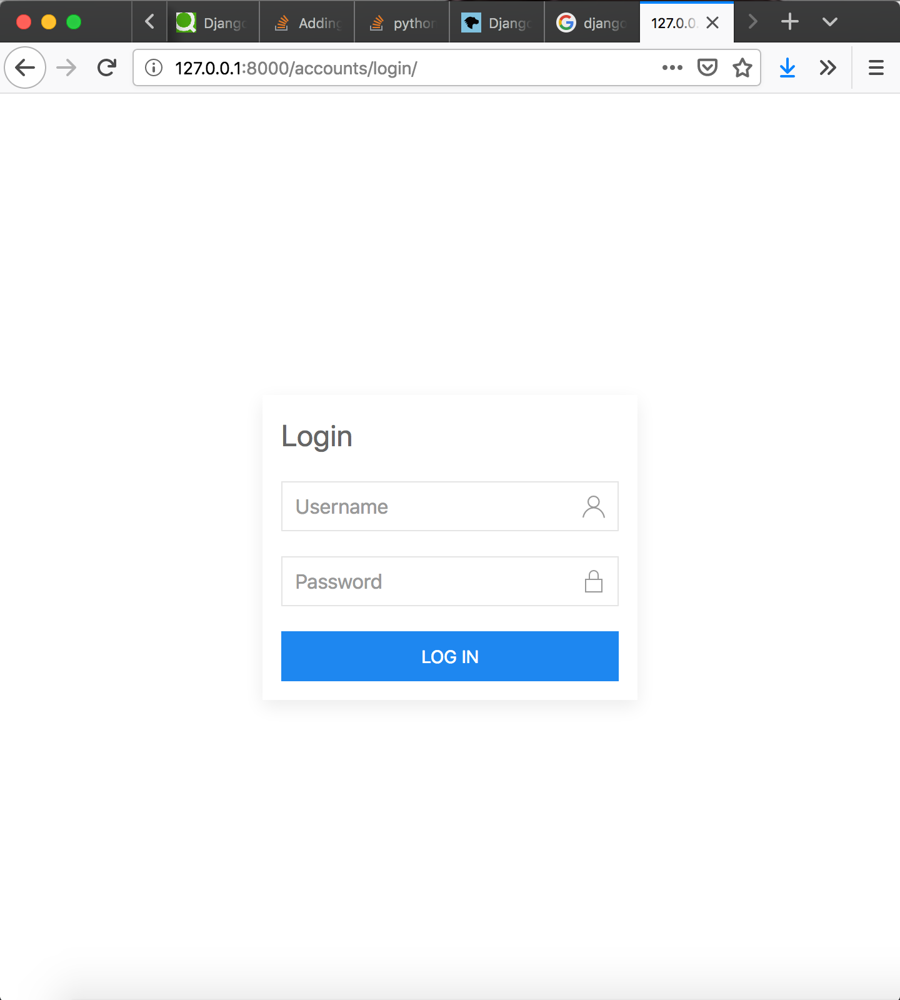

### アカウント周り

ログインのUIだけ作った

## 試しかた

```
% python manage.py createsuperuser
```

でユーザー作るかshellからユーザーを作成する

```
% python manage.py runserver
```

で開発用サーバーを起動して、http://127.0.0.1/accounts/loginにアクセスする
作成ずみのユーザーでログインすると、/accounts/profileに飛ばされる。まだ作ってないからエラーがでる。
間違えたら、同じページが表示される。



## TODO
* フォームの分離
* ログイン失敗時にフォームにuk-input-wargingを追加
* パスワードの作成とパスワードのリセットの追加
* プロファイルページを作る
* テストビューの分離とか


